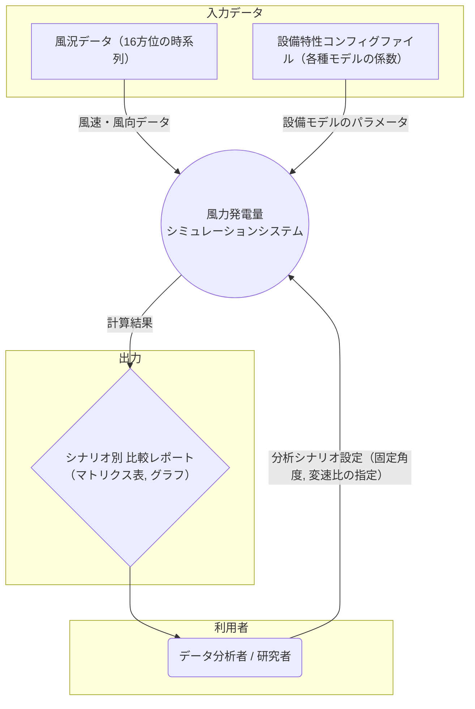

### システムコンテキスト図

### 図の解説

* **中央の円 (システム):**
    * `風力発電量シミュレーションシステム`
    * これが私たちが定義してきたシステムの本体です。外部から情報を受け取り、内部で計算処理を行い、結果を外部に出力します。

* **左側の四角形 (外部エンティティ):**
    * `データ分析者 / 研究者`: システムを操作する人間です。「どの角度と変速比で分析するか」といった**分析シナリオ**をシステムに指示します。
    * `風況データ`: 10分間隔の風速・風向が記録された、CSVファイルなどの外部データです。
    * `設備特性コンフィグファイル`: 風車や発電機の性能を決める多項式の係数などが定義された、JSONやYAML形式などの外部設定ファイルです。

* **右側のひし形 (出力データ):**
    * `シナリオ別 比較レポート`: システムの計算結果です。どの「固定角度」と「変速比」の組み合わせが最も発電量が多いかなどを示す、最終的なアウトプット（画面表示やファイル）を表します。

* **矢印 (データの流れ):**
    * **システムへの入力:** 「分析シナリオ」「風速・風向データ」「設備モデルのパラメータ」の3種類がシステムに入力されることを示しています。
    * **システムからの出力:** システムは計算結果を「比較レポート」として出力し、それが最終的に「データ分析者」に提供される流れを示しています。