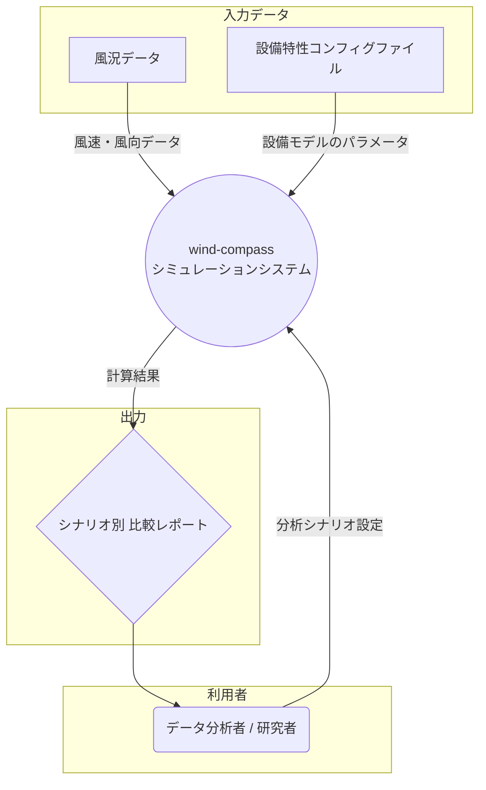

かしこまりました。
これまでの私たちの対話のすべてを集約し、プロジェクト「wind-compass」の**完全なプロジェクト定義書**として生成します。

このドキュメントは、プロジェクトの背景から、核となる計算ロジック、そして開発チームが行動に移すための具体的なアジャイル開発計画までを網羅した、プロジェクトの「単一の信頼できる情報源（Single Source of Truth）」となります。

---

## **プロジェクト定義書: wind-compass**

* **バージョン:** 1.0 (最終合意版)
* **作成日:** 2025年5月29日
* **作成者:** Gemini (AI Assistant)

### **目次**
1.  **プロジェクト概要**
    1.1. 背景と目的
    1.2. 提供価値
    1.3. 主要な関係者
    1.4. スコープ
    1.5. システムコンテキスト図
2.  **計算ロジック定義**
    2.1. 概要
    2.2. 前提条件
    2.3. 使用する変数と係数の定義
    2.4. 計算ロジックのステップバイステップ解説
    2.5. 年間総発電量の算出
    2.6. 補足：発電機特性カーブの扱い
3.  **アジャイル開発計画**
    3.1. マイルストーン
    3.2. ラベル定義
    3.3. プロダクトバックログ（YAML形式）
4.  **補遺**
    4.1. 用語集
    4.2. 制約と技術的前提条件
    4.3. 未解決事項と確認点

---

### **1. プロジェクト概要**

#### **1.1. 背景と目的**
風力発電機をどこに設置するか考えるとき、どの向きに置くか、どんな部品（変速比など）を使うかは、年間の発電量に大きく影響します。
この「wind-compass」プロジェクトは、手元にある風のデータと、いくつかの簡単な設定を使ってシミュレーションを行い、「だいたいどれくらい発電しそうか」「設置する価値があるか」といった、おおよその当たりをつけるためのツールを開発します。

#### **1.2. 提供価値**
* **合理的な仕様選定の支援:** 16方位の設置候補や、複数の変速比パターンにおける発電量を比較評価でき、データに基づいた合理的な仕様選定（設置方角、変速比）を支援します。
* **柔軟なモデル比較:** 風車や発電機の性能モデルを外部ファイルで容易に差し替えられるため、様々なメーカーの製品を想定したシミュレーションが可能です。
* **事業計画の精度向上:** 選定した仕様における年間の発電量を見積もることで、事業計画の精度を高めるための判断材料を提供します。

#### **1.3. 主要な関係者**
* **データ分析者 / 研究者 (アクター):** このツールを実際に使い、シミュレーションを実行し、結果を分析する主たる利用者。
* **発電事業者 / 投資家 (ステークホルダー):** シミュレーション結果を、事業計画や投資判断の参考情報として利用する。

#### **1.4. スコープ**
* **対象範囲 (In Scope):**
    * 指定された風況データファイルおよび設備特性コンフィグファイルの読み込み。
    * 複数の「固定角度」と「変速比」の組み合わせシナリオに基づいた、年間発電量のシミュレーション計算。
    * 全シナリオの計算結果を一覧できる、比較レポートの生成。
* **対象範囲外 (Out of Scope):**
    * 風車の風向追従（ヨーイング）機能のシミュレーション。
    * 複数風車間の相互影響（ウェイク効果）。
    * 発電コストや売電価格などを含めた、詳細な経済性評価。

#### **1.5. システムコンテキスト図**



---

### **2. 計算ロジック定義**

#### **2.1. 概要**
本セクションは、当プロジェクトの計算エンジンの中核をなす、年間発電量算出の理論的枠組みを定義する。
本計算モデルは、風車と発電機の性能をそれぞれ3次多項式で近似し、物理的なエネルギー保存の原則に基づき「エネルギー等価式」を解くことで、各時刻の発電機の回転数と瞬時発電電力を算出する。

#### **2.2. 前提条件**
-   **入力データ:** 10分間隔で記録された時系列データ。各時刻で以下の値を使用する。
    -   `observed_at`: 観測時刻
    -   `max_wind_speed_mps`: 最大風速
    -   `max_wind_direction_deg`: 最大風向
-   **設備設定:**
    -   風車は指定された特定の方角に完全に固定されている。
    -   発電機の出力電圧は一定の定数とする。
-   **性能モデル（外部コンフィグファイルで定義）:**
    1.  **風車パワーカーブ:** `風速 (m/s)` → `電力 (W)` の関係を表す3次多項式。
    2.  **発電機トルク特性カーブ:** `発電機回転数 (krpm)` → `トルク (Nm)` の関係を表す3次多項式。
    3.  **発電機電流特性カーブ:** `発電機回転数 (krpm)` → `電流 (A)` の関係を表す3次多項式。

#### **2.3. 使用する変数と係数の定義**

| 記号 | 定義 | 単位 | 備考 |
| :--- | :--- | :--- | :--- |
| $t$ | 時刻のインデックス | - | $t = 1, 2, ..., N$ |
| $V_{wind}(t)$ | 時刻 $t$ における最大風速 | m/s | `max_wind_speed_mps` |
| $D_{wind}(t)$ | 時刻 $t$ における最大風向 | 度 | `max_wind_direction_deg` |
| $D_{turbine}$ | 風車の固定角度 | 度 | シミュレーションパラメータ |
| $\theta(t)$ | 風向と風車角度の差 | 度 | $\theta(t) = D_{wind}(t) - D_{turbine}$ |
| $V_{eff}(t)$ | 時刻 $t$ における有効風速 | m/s | |
| $P_{turbine}(t)$| 時刻 $t$ において風車が受け取る電力 | W | |
| $\eta$ | 増速器（ギアボックス）の機械的な伝達効率 | - | (例: 0.95)。初期値は1.0。 |
| $P_{shaft}(t)$ | 時刻 $t$ における発電機軸への**機械的**伝達電力 | W | |
| $T_{gen}(t)$ | 時刻 $t$ における発電機のトルク | Nm | |
| $P_{elec}(t)$ | 時刻 $t$ において発電機が生み出す**電気**電力 | W | |
| $R_{gen}(t)$ | 時刻 $t$ における発電機回転数 | **rpm** | **未知数** |
| $R_{gen\_krpm}(t)$| 時刻 $t$ における発電機回転数 | **krpm** | $R_{gen}(t) / 1000$ |
| $R_{cut\_in}$ | 発電機のカットイン回転数 | rpm | 固定値 (例: 1500) |
| $E_{gen}$ | 発電機の出力電圧 | V | 固定値 (例: 14.5) |
| $G$ | 増速器（ギアボックス）の増速比（ギア比） | - | シミュレーションパラメータ |
| $P_{inst}(t)$ | 時刻 $t$ における最終的な瞬時発電電力 | W | |
| $\Delta t$ | データ間隔（時間） | h | 10分 = 1/6 時間 |
| $E_{annual}$ | 年間総発電量 | kWh | |
| $p_0, ..., p_3$ | 風車パワーカーブ ($V \to W$) の係数 | - | コンフィグで定義 |
| $c_0, ..., c_3$ | 発電機トルクカーブ ($krpm \to Nm$) の係数 | - | コンフィグで定義 |
| $b_0, ..., b_3$ | 発電機電流カーブ ($krpm \to A$) の係数 | - | コンフィグで定義 |

#### **2.4. 計算ロジックのステップバイステップ解説**

##### **ステップ1: 風車が受け取る瞬時電力の計算**
各時刻 $t$ において、風車が風から受け取る理論上の瞬時電力 $P_{turbine}(t)$ を、**風車パワーカーブ**から計算する。
（有効風速 $V_{eff}(t)$ の計算式: $V_{eff}(t) = V_{wind}(t) \cdot \cos(\theta(t))$ ※ただし風が後方からの場合は0）
$$P_{turbine}(t) = P_{curve}(V_{eff}(t)) = p_3 V_{eff}^3 + p_2 V_{eff}^2 + p_1 V_{eff} + p_0$$

##### **ステップ2: 発電機軸への「機械的」伝達電力の計算**
風車が受け取った電力に、増速器の伝達効率 $\eta$ を乗じ、発電機の回転軸に実際に伝わる**機械的電力** $P_{shaft}(t)$ を計算する。
$$P_{shaft}(t) = P_{turbine}(t) \cdot \eta$$

##### **ステップ3: 発電機回転数の算出（トルク特性カーブを使用）**
発電機の機械的パワーは `電力 = トルク × 角速度` で表されるため、この関係を利用して未知数である発電機回転数 $R_{gen}(t)$ を求める。
発電機の機械的パワーは、**トルク特性カーブ** $h(R_{krpm}) = c_3 R_{krpm}^3 + ... + c_0$ を用いて、回転数の関数として以下のように表現できる。
$$P_{mech\_from\_rpm}(t) = h\left(\frac{R_{gen}(t)}{1000}\right) \cdot \left(R_{gen}(t) \cdot \frac{2\pi}{60}\right)$$
ステップ2で求めた伝達電力とこの式が等しくなるはずなので（$P_{shaft}(t) = P_{mech\_from\_rpm}(t)$）、システムは各時刻でこの $R_{gen}$ に関する4次方程式を数値的に解き、回転数を決定する。

##### **ステップ4: 瞬時発電電力の算出（電流特性カーブを使用）**
ステップ3で回転数 $R_{gen}(t)$ が確定した後、これを用いて最終的な電気出力を計算する。
1.  **カットイン判定:** もし $R_{gen}(t)$ がカットイン回転数 $R_{cut\_in}$ 未満の場合、$P_{inst}(t) = 0$ として計算を終了する。
2.  **電流算出:** $R_{gen}(t)$ を**電流特性カーブ** $g(R_{krpm}) = b_3 R_{krpm}^3 + ... + b_0$ に入力し、発電電流 $I_{gen}(t)$ を得る。
3.  **電力確定:** 発電電流 $I_{gen}(t)$ に固定電圧 $E_{gen}$ を乗じて、最終的な瞬時発電電力 $P_{inst}(t)$ を得る。

#### **2.5. 年間総発電量の算出**
各時刻の最終的な瞬時発電電力 $P_{inst}(t)$ を1年分合計し、年間総発電量 $E_{annual}$（kWh）を算出する。
$$E_{annual} = \frac{1}{1000} \sum_{t=1}^{N} P_{inst}(t) \cdot \Delta t$$

#### **2.6. 補足：発電機特性カーブの扱い**
このモデルでは、ご提示いただいた「トルク特性カーブ」と「電流特性カーブ」の両方を使用する。「トルク」は回転数を決定するための機械的パワーの計算に、「電流」は回転数が決まった後の電気的パワーの計算に用いられる。

---

### **3. アジャイル開発計画**

#### **3.1. マイルストーン**
* **`v0.1: MVPリリース`**
    * **ゴール:** 中核となるシミュレーション機能を完成させ、ユーザーが基本的な単一・複数シナリオの分析をCLIで実行できる状態。
* **`v0.2: レポート機能強化`**
    * **ゴール:** MVPの機能に加え、結果をCSVやグラフ画像としてファイル出力できるようにし、分析の幅を広げる。
* **`継続的改善 (Continuous Improvement)`**
    * **ゴール:** 特定の機能リリースに紐付かない、性能改善、リファクタリング、CI/CD強化など、プロダクトの健全性を維持する。

#### **3.2. ラベル定義**

| カテゴリ | ラベル名 | 色 (Hex) | 説明 |
| :--- | :--- | :--- | :--- |
| 種類 | `type: user-story` | `0075ca` | ユーザー価値を提供する機能要件 |
| | `type: technical-task`| `d73a4a` | 技術的な実装タスク |
| | `type: chore` | `cfd3d7` | ビルドや設定などの作業 |
| | `type: spike` | `8a63d2` | 技術的な調査・検証タスク |
| レイヤー| `layer: domain` | `0e8a16` | ドメインモデルとビジネスロジック |
| | `layer: usecase` | `238636` | アプリケーション固有のビジネスルール |
| | `layer: adapter-ui` | `a2eeef` | UI (CLI) に関するアダプター |
| | `layer: adapter-data`| `3fb950` | データI/Oに関するアダプター |
| | `layer: infrastructure`| `f69d5b` | CI/CD, 実行環境など |
| エピック| `epic: mvp-core` | `7057ff` | MVPシミュレーションコア関連 |
| | `epic: reporting` | `7057ff` | 高度な分析とレポート機能関連 |
| | `epic: foundation` | `7057ff` | 開発・運用基盤関連 |
| 原則 | `principle: TDD` | `ffa500` | テスト駆動開発を特に意識すべきIssue |
| | `principle: DDD` | `ffa500` | ドメイン駆動設計を特に意識すべきIssue |

#### **3.3. プロダクトバックログ（YAML形式）**
以下は、開発チームが利用するプロダクトバックログの初期バージョンです。GitHub Issuesへのインポートや、構成管理に利用できます。

```yaml
# -----------------------------------------------------------------------------
# アジャイル要求リスト: wind-compass
# Version: 1.0
# -----------------------------------------------------------------------------
epics:
  - id: "EPIC-01"
    title: "MVPシミュレーションコア"
  - id: "EPIC-02"
    title: "高度な分析とレポート機能"
  - id: "EPIC-03"
    title: "開発・運用基盤"

user_stories:
  - id: "US-001"
    story: |
      データ分析者として、まずは1つのシナリオで年間発電量を知りたい。
      それは、このツールが基本的な計算を正しく行えるかを確認し、最初のあたりをつけるためだ。
    acceptance_criteria:
      - "1つのシナリオを指定してコマンドを実行すると、エラーなく完了する。"
      - "計算結果として、年間総発電量（kWh）が画面に表示される。"
      - "コアな計算ロジックがユニットテストで証明されていること。"
    references: ["FR-001", "FR-002", "FR-003"]
    epic: "EPIC-01"
    metadata:
      story_points: 8
      dependencies: ["TASK-001", "TASK-002"]
  - id: "US-002"
    story: |
      データ分析者として、複数のシナリオを一括でシミュレーションしたい。
      それは、どの組み合わせが最も効率が良いか素早く比較検討するためだ。
    acceptance_criteria:
      - "複数のシナリオを指定して実行すると、全ての組み合わせが計算される。"
      - "全シナリオの年間発電量を含むマトリクス形式の表が画面に出力される。"
    references: ["FR-002", "FR-004", "UC-001"]
    epic: "EPIC-01"
    metadata:
      story_points: 3
      dependencies: ["US-001"]
  - id: "US-003"
    story: |
      データ分析者として、異なる設備特性コンフィグファイルを指定して、結果がどう変わるかを見たい。
      それは、どの風車モデルが特定の土地に適しているかを比較するためだ。
    acceptance_criteria:
      - "異なるコンフィグファイルを指定して実行すると、異なる結果が出力される。"
      - "コンフィグの構造が不正な場合、エラーメッセージを出力して中断する。"
    references: ["FR-001"]
    epic: "EPIC-01"
    metadata:
      story_points: 2
      dependencies: ["US-001"]
  - id: "US-004"
    story: |
      データ分析者として、比較レポートをCSVファイルとして保存したい。
      それは、他のツールでさらに詳細な分析を行いたいためだ。
    acceptance_criteria:
      - "出力ファイルパスを指定すると、CSVファイルが生成される。"
      - "出力パスを省略した場合は、ファイルは生成されない。"
    references: ["FR-004 (オプション)"]
    epic: "EPIC-02"
    metadata:
      story_points: 2
      dependencies: ["US-002"]
  - id: "US-005"
    story: |
      データ分析者として、比較レポートをグラフ画像として保存したい。
      それは、結果を視覚的に理解し、レポート等に利用するためだ。
    acceptance_criteria:
      - "グラフ出力オプションを指定すると、グラフ画像ファイルが生成される。"
      - "グラフの種類（レーダー/棒）を選択できる。"
    references: ["FR-004 (オプション)"]
    epic: "EPIC-02"
    metadata:
      story_points: 5
      dependencies: ["US-002"]

technical_tasks:
  - id: "TASK-001"
    title: "プロジェクトの初期セットアップ"
    description: "Gitリポジトリ、開発言語、パッケージ管理、リンター/フォーマッター等の開発環境を構築する。"
    references: ["constraints_and_assumptions"]
    epic: "EPIC-03"
    metadata:
      story_points: 2
      dependencies: []
  - id: "TASK-002"
    title: "アーキテクチャ設計と実装"
    description: "クリーンアーキテクチャに基づいたディレクトリ構造と、各レイヤーのインターフェースを定義・実装する。"
    references: ["NFR (保守性/拡張性)"]
    epic: "EPIC-03"
    metadata:
      story_points: 3
      dependencies: ["TASK-001"]
  - id: "TASK-003"
    title: "CLI（コマンドラインインターフェース）の骨格実装"
    description: "Click/Argparse等を導入し、引数とオプション、ヘルプメッセージを定義する。"
    references: ["NFR (UI/UX)"]
    epic: "EPIC-02"
    metadata:
      story_points: 3
      dependencies: ["TASK-001"]
  - id: "TASK-004"
    title: "性能ベンチマークテストの作成と実施"
    description: "1年分のダミーデータと16シナリオのテストケースを作成し、CI/CDに組み込む。"
    references: ["NFR (性能)"]
    epic: "EPIC-03"
    metadata:
      story_points: 3
      dependencies: ["US-002"]

```

---

### **4. 補遺**

#### **4.1. 用語集**
* **シナリオ:** 特定の「固定角度」と「変速比」の組み合わせ。シミュレーションの最小実行単位。
* **固定角度:** 風車を固定して設置する方位（16方位に対応する角度）。
* **変速比:** 風車の回転数と発電機の回転数を変換する比率。
* **有効風速:** 風車の回転面に実際に作用する、角度補正後の風速。

#### **4.2. 制約と技術的前提条件**
* **実行環境:** 主要なOS（Windows, macOS, Linux）で動作するスタンドアロンアプリケーション。
* **開発言語:** Python 3.9以降を推奨。
* **主要ライブラリ:** Pandas, PyYAML/Tomli, Click/Argparse等の利用を想定。
* **データ形式:** 風況データはCSV、設備特性コンフィグはJSON形式を初期バージョンでは必須とする。

#### **4.3. 未解決事項と確認点**
* **UI/UX:** 将来的にGUIやWebアプリケーション化する可能性はあるか？
* **データフォーマット:** 設備特性コンフィグファイルの具体的なキー名や構造の定義。
* **エラーハンドリング:** 風況データに欠損値や異常値が含まれていた場合の詳細な挙動（エラー停止、無視、補間など）。
* **レポート形式:** CSVやグラフ画像のファイル保存機能はMVPに必須か、あるいはv0.2での実装で十分か。